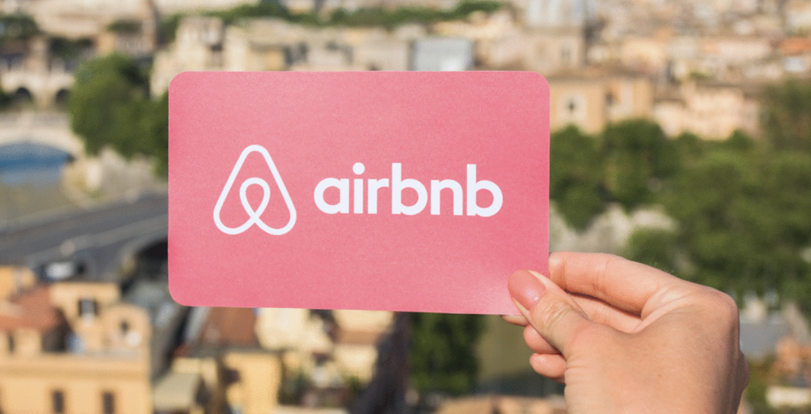
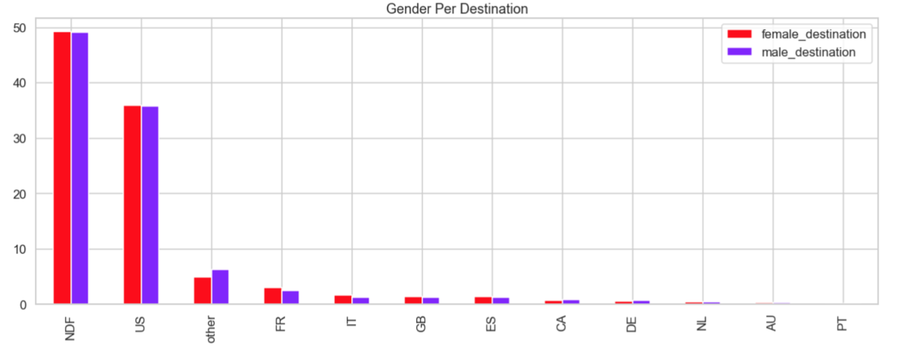
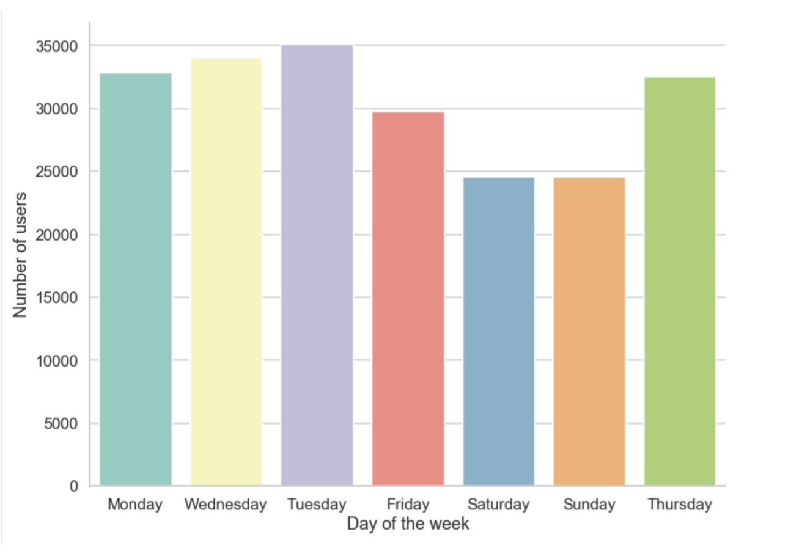

# Airbnb challenge: Which country will be the holiday destination for new users?

Airbnb began in 2008 from the idea of two designers who want to share their spare rooms in their home to travelers and since that moment millions of hosts and travelers choose to create a free Airbnb account so they can list their space and book unique accommodation anywhere in the world. What makes unique Airbnb is the experience itself and the fact that hosts and travelers can share their passions and experiences in almost all the corners of the world. The challenge of my project is to build a predictive model that can accurately suggest the first destination of a new Airbnb User. All the processes involved, such as exploratory data analysis, feature engineering, data cleaning and the machine learning models have been divided into main sections in the notebook and the reader is advised to read it sequentially to have a complete understanding of the whole project. There are 12 possible outcomes of the destination country: 'US', 'FR', 'CA', 'GB', 'ES', 'IT', 'PT', 'NL','DE', 'AU', 'NDF' (no destination found), and 'other' and the users considered in this analysis are only USA citizens. 

### Contact details

Email: soledadmusella@gmail.com

LinkedIn: linkedin.com/in/soledad-musella-bb8665104

### Table of Contents: 

- [Technologies used]()
- [Executive Summary]()
- [Exploratory Data Analysis]()
- [Data Cleaning and Feature Engineering]()
- [Modelling]()
- [Future Improvements]()

### Technologies used

- Python
- Pandas
- Seaborn
- Matplotlib
- Numpy
- Scikit-learn

### Executive Summary

For this project I've taken inspiration from the competition launched by Airbnb and closed in 2016, using the data set related. As the competition was close, I decided to used different evaluators from the one suggested by it, the Normalized discounted cumulative gain (NDCG) because my goal was to go beyond the challenge itself. In this project a series of classifiers such as Logistic Regression, Decision Trees and KNN are trained and improved to give the best prediction and give Airnbn and similar companies useful insights to improve significantly their marketing strategies and therefore their profit.

### Exploratory Data Analysis

The very first step was to load the data available into Pandas Dataframe and extract basic information such as the distribution of the values, the nature of the values and the possible relationship between them. In particular I focused my research on understanding if there could be a gender-based preference for certain countries and if, as a result, gender could be a decisive feature correlated to the decision of whether to choose a country or another. I also created new columns by performing feature engineering to find out which are the days of the week in which is more likely to have new accounts created. Surprisingly the week-end days turned out to be the less active days in terms of creating new accounts. 

                                                                                                                            

### Data Cleaning and Feature Engineering

I have been working on two datasets in particular, the first called "sessions" and the second called "users". Both of the datasets were row and with a huge number of null values. The data cleaning process was focused on solving the problems given by having null categorical values and trying to find the best way to handle them to avoid further bias during the modelig part. In addiction, to that I' ve been performing some future engineering by creating new variables( "day of the week", "first action", "last_action_detail" etc) and merging the data sets with new columns in one unique and meaningful final data set: "final_users".

### Modeling review

Predicting holiday destinations for new Airbnb users presents a very specific and unique problem: it is a multiclass classification. Having said that, I decided to use Logistic Regression as a baseline model since I felt it could be a good starting point from which to start all the next further improvements. My next steps regarding modeling are to use more complex models as Decision Trees and KNN in order increase the godness of the prediction.   

### Future Improvements

The data sets that I've used to perform my analysis have an incredible potencial in terms of information and consequently insights. To be continued..

